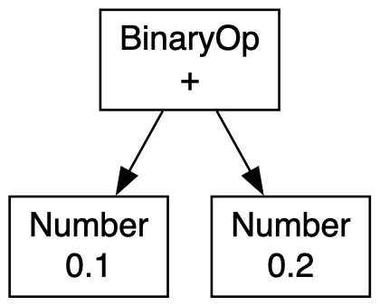

Language to write business expressions
======================================

Standalone no-dependency library.

### How to use
```php
use Basko\Lang\Parser;

$parser = new Parser();

$context = new EvaluateContext();
$context->addVariable('user', $user);

$result = $parser->parse('user.countOrders > 10 && user.status in ["vip", "premium"]')->evaluate($context);
```

### Graph
```php
use Basko\Lang\Export\GraphvizExport;

$parser = new Parser();

$ast = $parser->parse('0.1 + 0.2');

$graph = new GraphvizExport();
$graph->build($ast);
```
For example, you can visualize the output of `GraphvizExport::build()` with https://dreampuf.github.io/GraphvizOnline.


